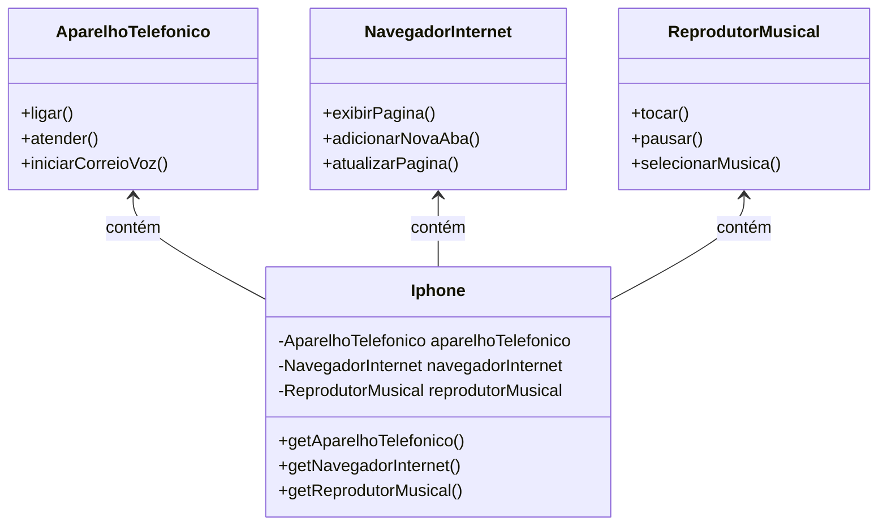

## Diagrama de classes

```mermaid
classDiagram
    class AparelhoTelefonico {
        +ligar()
        +atender()
        +iniciarCorreioVoz()
    }

    class NavegadorInternet {
        +exibirPagina()
        +adicionarNovaAba()
        +atualizarPagina()
    }

    class ReprodutorMusical {
        +tocar()
        +pausar()
        +selecionarMusica()
    }

    class Iphone {
        -AparelhoTelefonico aparelhoTelefonico
        -NavegadorInternet navegadorInternet
        -ReprodutorMusical reprodutorMusical
        +getAparelhoTelefonico()
        +getNavegadorInternet()
        +getReprodutorMusical()
    }

    AparelhoTelefonico <-- Iphone : contém
    NavegadorInternet <-- Iphone : contém
    ReprodutorMusical <-- Iphone : contém
```
